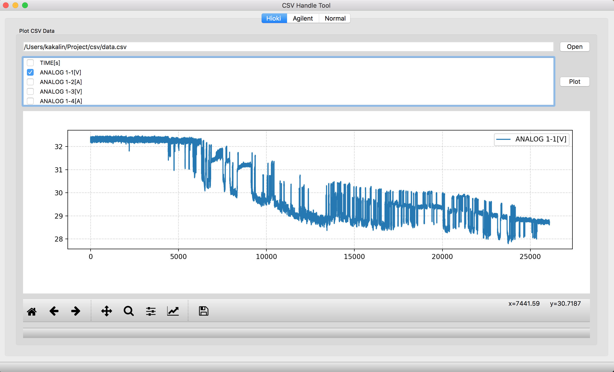

# CSV檔畫圖小程式

此程式能將.csv檔之data匯入並選擇您要的項目繪製成圖

## 建置

### 作業系統

支援Windows、Ubuntu、macOS

### 安裝相依程式庫

此專案使用了下列程式庫，建置前必須先在系統上安裝這些程式庫的開發環境：

- PyQt 5.9
- Python 3.5.0+

#### macOS

使用 Homebrew 用下列命令安裝上述程式庫

    $ brew install qt5 python3

使用 pip 安裝python所需模組
    
    $ pip3 install -r requirements.txt

#### Window

使用各種方法安裝python3.5以上版本

使用 pip3 安裝python所需模組

    $ pip3 install -r requirements.txt

## 執行

環境都建置好之後便可執行檔案

    $ python3 csvtool.py

## 範例

